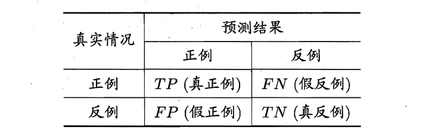
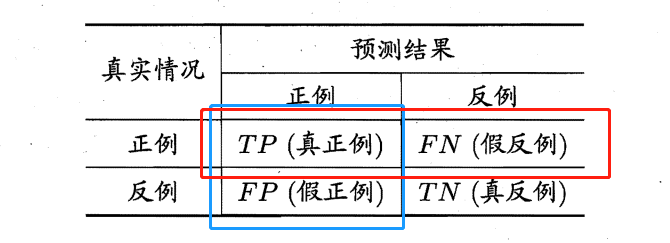
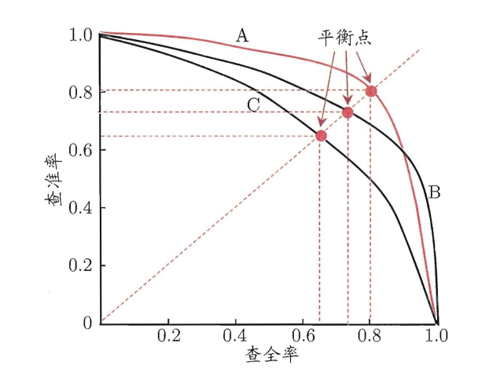

# 模型评估与选择

## 混淆矩阵

对于二分类问题，可将样例根据其真实类别与学习器预测类别的组合划分为真正例($true positive$) 、假正例 ($false positive$) 、真反例($true negative$) 假反例 ($false negative$) 四种情形，用$TP、FP、TN、FN$分别表示其对应的样例数。

## 查全率、查准率和$F1$

**查全率**

红框中$TP$的比例
$$R = \frac{TP}{TP+FN}$$
**查准率**

蓝框中$TP$的比例
$$
P = \frac{TP}{TP + FP}
$$

> 查准率和查全率是一对矛盾的度量。一般来说，查准率高时，查全率往往偏低；而查全率高时，查准率往往偏低。
>
> 例如，若希望将好瓜尽可能多地选出来， 则可通过增加选瓜的数量来实现，如果将所有西瓜都选上，那么所有的好瓜也必然都被选上了，但这样查准率就会较低；若希望选的瓜中好瓜比例尽可能高，则可只挑选最有把握的瓜 但这样就难免会漏掉不少好瓜，使得查全率较低。

**$F1$​**

$F1$值综合考虑查准率和查全率的性能
$$F1 = \frac{2 \times P \times R}{P + R}$$

## $PR$曲线

根据学习器的预测结果对样例进行排序，排在前面的是学习器认为"最可能 "是正例的样本，排在最后的则是学习器认为"最不可能"是正例的样本。按此顺序逐个把样本作为正例进行预测，则每次可以计算出当前的查全率、 查准率。

以查准率为纵轴、查全率为横轴作图 ，就得到了查准率查全率曲线，亦称$PR$曲线或$PR$图。

以信息检索应用为例，逐条向用户反馈其可能感兴趣的信息，即可计算出查全率、查准率。

PR 曲线直观地显示出学习器在样本总体上的查全率、 查准率。在进行比较时，若一个学习器的 PR 曲线被另一个学习器的曲线完全"包住，则可断言后者的性能优于前者。如图，学习器$A$的性能优学习器$C$。

 如果两个学习器$PR$曲线发生了交叉，例如图中的$A$与$B$ ，则难以一般性地断言两者孰优孰劣，只能在具体的查准率或查全率条件下进行比较。然而，在很多情形下，人们往往仍希望把学习器比出个高低，这时一个比较合理的判据是比较$PR$曲积的大小，它在一定程度上表征了学习器在查准率和查全率上取得相对"双高"的比例，但这个值不太容易估算， 因此人们设计了一些综合考虑查准和查全率的性能度量。

 "平衡点“($Break-Event Point $，简称$BEP$)就是这样一个度量，它是" 查准率=查全率"时的取值。基于$BEP$的比较，可认为学习器$A$优于$B$。

## $ROC$和$AUC$

